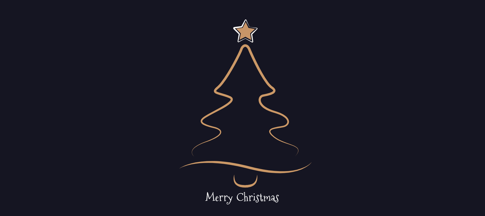

# Christmas Tree Animation 🎄

## Overview
The "Christmas Tree" project is a dynamic and interactive animation featuring a festive Christmas tree adorned with glowing particles and sparkling effects. The animation is created using the GSAP (GreenSock Animation Platform) library to bring life to SVG elements, creating a visually appealing experience.

## Features
- Particle animations along motion paths.
- Glowing effects and sparkle particles.
- Tree animations using SVG paths.
- Opacity transitions and random scaling for dynamic visuals.
- Optimized animation using GSAP timelines.
- Responsive design for various screen sizes.

## Screenshot

## How It Works
1. The `script.js` contains the main logic and animation setup using GSAP.
2. The `treePath.svg` holds the path for the Christmas tree, along which particles move.
3. Particles and sparkle elements animate along the tree path, creating a festive, glowing effect.

## Customization
- You can modify the `script.js` to change animation timings, colors, or particle effects.
- Update the tree path or particle styles by editing the `treePath.svg` and `script.js`.

## Optimization Tips
- Optimize the particle count based on performance needs.
- Ensure smooth animation by adjusting GSAP settings like ease, duration, and stagger.
- Minimize unnecessary requests by caching external assets.

## Contributing
- If you'd like to contribute or enhance this project, feel free to submit a pull request on [GitHub](https://github.com/yourusername/christmas-tree-animation).
- Contributions like new particle effects, animations, or design improvements are welcome!
---

Merry Christmas!
